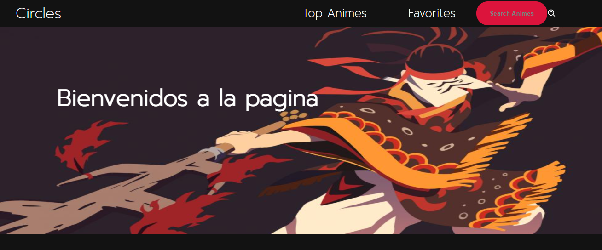

able of contents
* [General info](#general-info)
* [Technologies](#technologies)
* [Setup](#setup)

## General info
This project consists in a anime web side with several features like the search engine and a way to create an list of favorites animes.The information is shown in cards in whitch they have the tittle and the number of episodes. This project was made as part of the Globant Bootcamp.
## Technologies
Project is created with:
* RCA
* Redux
* Redux-Thunk
* Enzyme
* Jest
* Jinkan API
* React-router
	
## Setup
To run this project, install it locally using npm:
$ npm start
When the proyect starts this will be the first image shown 

